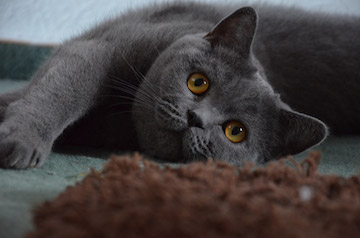
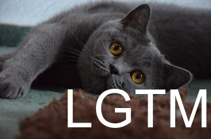

# LGTM Generator

Generate your own LGTM images on CLI!!

#### Input


#### Output


## Usage

By executing this command, you can generate `output.jpg` !

```sh
$ ruby lgtm-generator.rb [INPUT_IMAGE_FILE_PATH] [COLOR (OPTIONAL)]
# ex. ruby lgtm-generator.rb input.png "white"
```
